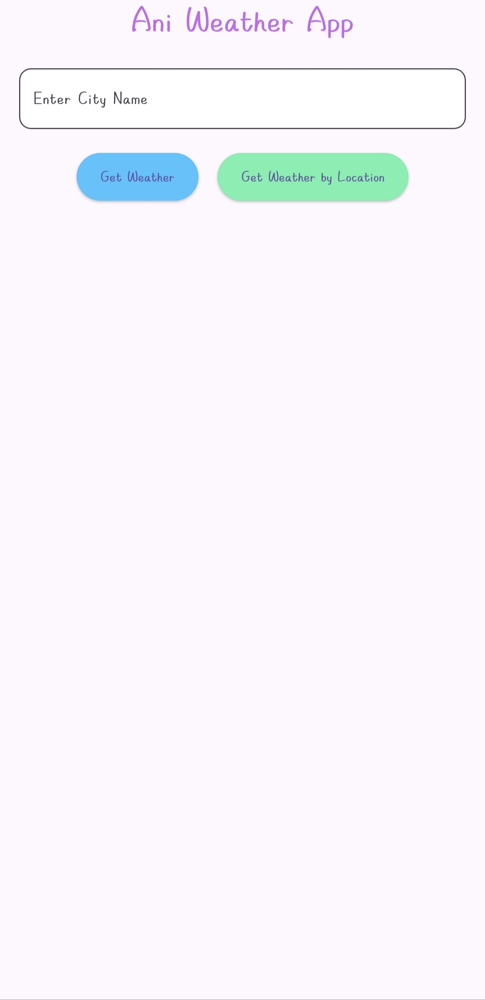
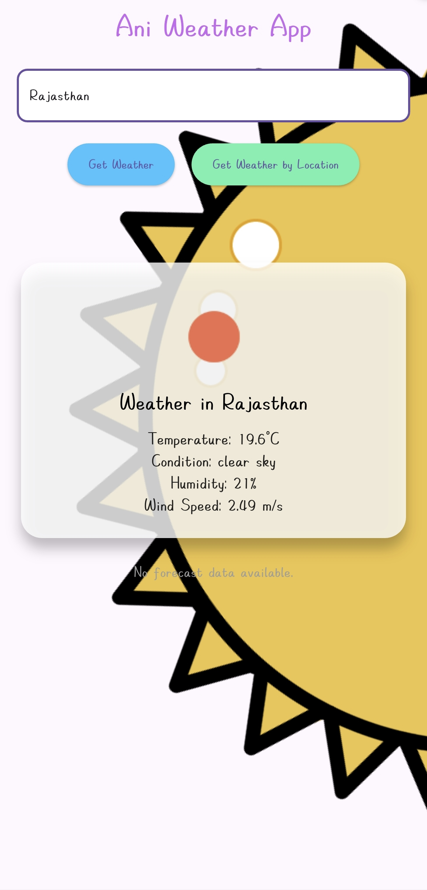

### **README.md**

# **Ani Weather App**

Ani Weather App is a beautifully designed, highly accurate weather application built using **Flutter**. This application provides real-time weather information for any location. It uses advanced APIs to deliver precise data, including temperature, weather conditions, humidity, and wind speed—all presented in an intuitive and visually engaging interface.

---

## **Features**

- **Accurate Weather Data**: Get real-time weather updates with precise decimal values, unmatched by many other famous weather applications.
- **Location-Based Weather**: Fetch weather information for your current location using GPS or search for any city worldwide.
- **Dynamic Weather Animations**: Visualize weather conditions with beautiful animations (e.g., rain, clear skies, clouds, snow, mist, etc.).
- **User-Friendly UI**: A clean and modern design that is easy to navigate, featuring a gradient-based theme that adjusts to the time of day.
- **Detailed Weather Information**: Includes temperature, humidity, wind speed, and atmospheric conditions.
- **Works Offline**: Displays cached weather data when offline.
- **Free and Open Source**: Completely free and customizable for developers.

---

## **Screenshots**

| Home Screen                                        | Search Weather                                           |
| -------------------------------------------------- | -------------------------------------------------------- |
|  |  |

---

## **How to Install and Run the App**

### **1. Prerequisites**

- **Flutter SDK**: Install Flutter from [Flutter Installation Guide](https://docs.flutter.dev/get-started/install).
- **Dart SDK**: Comes pre-installed with Flutter.
- **Android Studio** or **Xcode**: For building and testing on emulators or physical devices.
- **OpenWeatherMap API Key**: Sign up at [OpenWeatherMap](https://openweathermap.org/) and generate an API key.

---

### **2. Clone the Repository**

Run the following command in your terminal:

```bash
git clone https://github.com/your-username/ani-weather-app.git
cd ani-weather-app
```

---

### **3. Configure the API Key**

1. Open `lib/services/weather_service.dart`.
2. Replace `YOUR_API_KEY` with your OpenWeatherMap API key:
   ```dart
   const String apiKey = "YOUR_API_KEY";
   ```

---

### **4. Install Dependencies**

Run the following command to fetch the required dependencies:

```bash
flutter pub get
```

---

### **5. Run the Application**

#### **On Android**:

1. Connect your Android device or open an emulator.
2. Run:
   ```bash
   flutter run
   ```

#### **On iOS**:

1. Open the project in Xcode (`ios/Runner.xcworkspace`).
2. Configure signing under "Signing & Capabilities."
3. Run the app in the simulator or on a physical device.

---

## **Build the Application for Production**

### **Android APK**:

Generate the release APK:

```bash
flutter build apk --release
```

The APK will be available at `build/app/outputs/flutter-apk/app-release.apk`.

### **iOS Build**:

Run the following command to generate the IPA file:

```bash
flutter build ipa
```

---

## **How It Works**

1. **Weather Search**:

   - Enter a city name or use GPS to fetch weather details.

2. **Real-Time Updates**:

   - The app fetches live weather data, including temperature, humidity, wind speed, and condition descriptions.

3. **Dynamic Animations**:
   - Animations update in real-time to reflect current weather conditions (e.g., rain animation for rainy weather).

---

## **Technical Details**

### **1. Technology Stack**

- **Language**: Dart
- **Framework**: Flutter
- **API**: OpenWeatherMap One Call API

### **2. Project Structure**

```
ani-weather-app/
│
├── lib/
│   ├── main.dart                  # Entry point of the application
│   ├── screens/
│   │   └── home_screen.dart       # Main home screen UI
│   ├── services/
│   │   └── weather_service.dart   # Handles API requests and data parsing
│   ├── widgets/
│       └── forecast_widget.dart   # Reusable widget for the 7-day forecast
│
├── assets/
│   ├── animations/                # Lottie animations for weather conditions
│   └── screenshots/               # App screenshots
│
├── android/                       # Android-specific files
├── ios/                           # iOS-specific files
├── pubspec.yaml                   # Dependencies and assets configuration
└── README.md                      # Project documentation
```

---

## **Major Highlights**

- **Precision in Decimal Data**: Unlike many popular weather apps, Ani Weather App displays temperature and other metrics with precise decimal values, ensuring higher accuracy.
- **Offline Capability**: Displays cached weather data when offline.
- **Animations**: Custom animations make weather visualization engaging.

---

## **API Reference**

The app uses the **OpenWeatherMap One Call API**:

- **Current Weather**: Provides real-time weather details.

Learn more at [OpenWeatherMap One Call API Documentation](https://openweathermap.org/api/one-call-api).

---

## **Future Enhancements**

- **Hourly Forecast**: Add support for hourly weather predictions.
- **Air Quality Index (AQI)**: Include AQI for the selected location.
- **Multiple Language Support**: Enable translations for a global audience.
- **Dark Mode**: Improve user experience in low-light conditions.
- **7-day Weather Forecast**: A detailed 7-day weather forecast of any location around the globe including current one.

---

## **Contributions**

We welcome contributions! Follow these steps to contribute:

1. Fork the repository.
2. Create a new branch for your feature or bugfix:
   ```bash
   git checkout -b feature-name
   ```
3. Commit your changes:
   ```bash
   git commit -m "Add your message here"
   ```
4. Push to your branch:
   ```bash
   git push origin feature-name
   ```
5. Open a pull request on GitHub.

---

## **License**

This project is licensed under the [MIT License](LICENSE).

---

## **Support**

For any issues or feature requests, please open an issue on [GitHub](https://github.com/your-username/ani-weather-app/issues).

---

Let me know if there’s anything else you’d like to add or modify! 🚀
